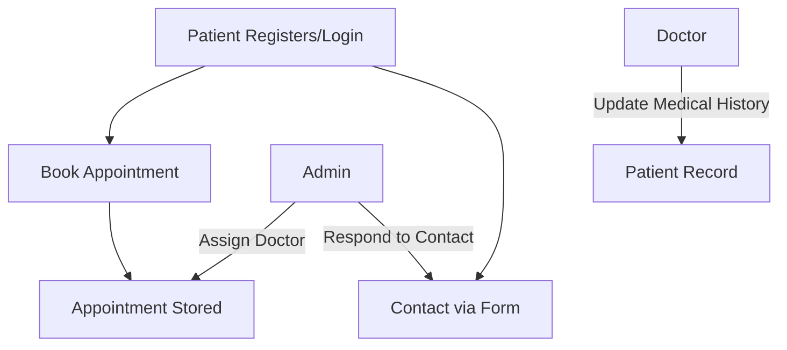

# CARE – Hospital Management System

**Tagline**: *Streamlining Healthcare, One Click at a Time*

## 📌 Project Overview

CARE is a web-based Hospital Management System built to streamline patient management, appointment scheduling, doctor allocation, and administrative functions within a healthcare setup. The system supports three user roles: **Admin**, **Doctor**, and **Patient**, each with specific access controls and capabilities. It automates critical operations to improve efficiency, reduce manual errors, and enhance the user experience in hospitals and clinics.

---

## 👥 Team Members – Aptech Pakistan

* **Fatima Nahid** *(Team Lead)*
* Javeria
* Abdul Ghani
* Huzaifa
* Ashar

---

## 🧰 Tech Stack

* **Backend**: PHP (Core PHP)
* **Frontend**: HTML5, CSS3, JavaScript, Bootstrap 5
* **Database**: MySQL (phpMyAdmin)
* **Other Tools**: XAMPP, Visual Studio Code

---

## 🧑‍💼 User Roles & Features

### 🛡️ Admin

* Register and manage doctor profiles
* View and manage patient records
* Handle appointments and appointment requests
* Post blogs/news via content management
* View contact messages and give admin feedback
* Manage cities, company settings, and web pages

### 👨‍⚕️ Doctor

* Log in and manage their profile
* View and update assigned patient medical history
* View appointment details
* Add medical prescriptions and diagnosis

### 👩‍⚕️ Patient

* Self-register and log in
* Book appointments with doctors
* View their medical history and appointment status
* Contact hospital via contact form

---

## 🗂️ Main Database Tables (MySQL)

| Table Name               | Purpose Description                               |
| ------------------------ | ------------------------------------------------- |
| `admin`                  | Stores admin login credentials                    |
| `doctors`                | Contains doctor profiles and credentials          |
| `users`                  | Stores patient registration details               |
| `appointment`            | Appointment records linking doctor, patient, fees |
| `appointment_requests`   | Stores public appointment queries                 |
| `tblpatient`             | Individual patient records with assigned doctor   |
| `tblmedicalhistory`      | Patient medical records and prescriptions         |
| `doctorspecilization`    | Master list of medical specializations            |
| `posts`                  | Blog/news posts data                              |
| `post_images`            | Images linked to posts                            |
| `tblcontactus`           | Contact form submissions                          |
| `userlog` / `doctorslog` | Login sessions of users and doctors               |
| `company_settings`       | Static site configuration (name, contact)         |
| `cities`                 | Available cities for address selections           |
| `tblpage`                | Dynamic content like "About Us", "Contact Us"     |

---

## 🔗 System Workflow (Basic)



---

## 📊 Data Flow Diagram (DFD)

A Level 1 DFD is included in the submission package (see: `A_Data_Flow_Diagram_(DFD)_for_a_Hospital_Management.png`), showing:

* Patient Registration Flow
* Appointment Booking
* Medical Record Handling
* Admin & Doctor Interaction

---

## 🧪 Sample Login Credentials

```
Admin:
  Username: admin
  Password: allah786

Doctor:
  Email: anujk123@test.com
  Password (MD5): Test@123

Patient:
  Email: johndoe12@test.com
  Password (MD5): Test@123
```

> Note: Passwords are stored using MD5 (for demonstration only – not secure for production use).

---

## 📁 File Structure

```
CARE/
├── admin/
│   ├── appointments/
|   ├── assets/
|   ├── auth/
|   ├── cities
|   ├── doctors/
│   ├── includes/
│   ├── news/
│   ├── patients/
│   ├── queries/
│   ├── reports/
│   ├── uploads/
│   ├── vendor/
│   ├── dashboard.php
│   ├── index.php
│   └── manage-user.php
├── assets/
│   ├── css/
│   ├── js/
│   ├── images/
├── database/ 
├── doctor/
├── include/
├── master/
├── patient/
│   ├── assets/
|   ├── auth/
│   ├── includes/
│   ├── vendor/
│   ├── appointment-history.php
│   ├── book-appointment.php
│   ├── dashboard.php
│   ├── index.php
│   └── manage-history.php
├── vendor/
├── assets/
└── index.php/
```

---

## 📦 How to Run

1. Install **XAMPP** and start **Apache** & **MySQL**
2. Clone or copy the project into `htdocs` folder
3. Import `hms.sql` from `phpMyAdmin` into a new database named `hms`
4. Update `include/config.php` with your local DB credentials if necessary
5. Visit `http://localhost/Care/index.php`

---

## ✅ Features Summary

* Patient Medical History Tracker
* Secure Role-Based Authentication
* Dynamic Blog System for Health Tips
* Admin Contact Response System
* Multi-city Support for Records
* Appointment Management (Direct & Request-based)

---

## 🔒 Security Notes

* Sessions are used for user authentication
* Passwords stored using MD5 (recommended to upgrade to `bcrypt` or `argon2`)
* Basic input validation included

---
How to run the Auto/Taxi Stand Management Project Using PHP and MySQL

. Download the zip file
2. Extract the file and copy hospital folder
3.Paste inside root directory(for xampp xampp/htdocs, for wamp wamp/www, for lamp var/www/html)
4. Open PHPMyAdmin (http://localhost/phpmyadmin)
5. Create a database with name hms
6. Import hms.sql file(given inside the zip package in SQL file folder)
7.Run the script http://localhost/hospital (frontend)
Login Details
Login Details for admin : admin/Test@12345
Login Details for Patient: johndoe12@test.com/Test@123
Login Details for Doctor: anujk123@test.com/Test@123


## 📌 License

This project is part of the **eProject submission** for Aptech Pakistan and is shared for academic and learning purposes only.